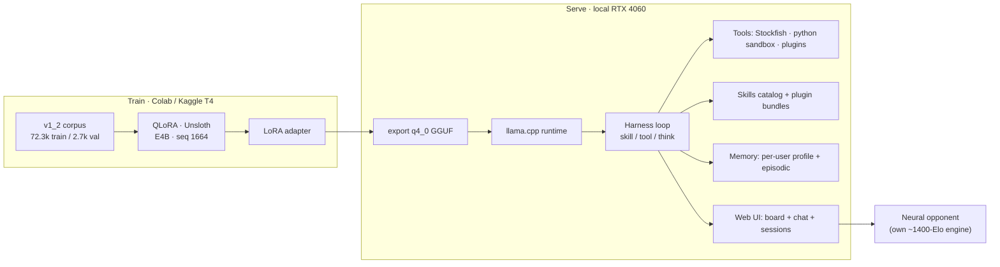

<div align="center">

# ♞ Gemma-4 Agentic Harness

**A small open model trained to *operate* tools and skills — not to memorize answers.**
Chess coaching is the flagship demo; the product is the general harness underneath.


</div>

---

## What this is

Most "AI chess coaches" are a chatbot bolted onto an engine. This is the opposite bet.

We fine-tune **Gemma 4 E4B** to be a **general agentic operator**: given a goal and a prompt-listed
set of **skills** and **tools** — in *any* domain — it reasons, picks **one action per step**, runs it,
and narrates the result. Crucially, it **grounds every factual claim in real tool output** instead of
inventing numbers. It calls Stockfish for an evaluation rather than guessing it; it runs a Python
snippet to check an average rather than doing mental math.

Chess is the demo domain because it is unforgiving — an illegal move or a wrong eval is *obvious*. But
the corpus is **~75% general / ~25% chess**, and the same model routes cooking, music theory, tax math,
and wellness tasks it was never specialized for, using only the skills and tools listed in its prompt.

## The contract

The whole interface is **two verbs**, one action per step:

```
<skill>NAME</skill>        load a listed skill's body into context   (progressive disclosure)
<tool>NAME arg=value</tool>   call a function and read its result        (grounding)
```

Reasoning runs in four prompt-selected modes: **fast** (act immediately), **think** (reason every step),
**auto** (reason only on hard decisions — interleaved), and **plan** (emit a `<goal>` + a checklist first).

### See it think

```text
‹auto mode›  "I scored 70, 10, and 8 on three quizzes — is my average above 85?"

<think>Three scores. I'll verify the mean with the python tool instead of doing it in my head.</think>
<tool>python code="print(sum([70,10,8])/3)"</tool>
   → 29.333333333333332
Your average is 29.3 — well below 85. The two low scores are dragging it down hard.
```

```text
‹fast mode›  "how am I doing in this position?"

<tool>eval depth=18</tool>
   → eval: +0.34 (white slightly better)
You're a touch better, about +0.3 — the bishop pair gives a small pull, nothing decisive yet.
```

```text
"teach me about knight forks"

<skill>tactics_knight_forks</skill>
A knight fork hits two targets at once because the knight's L-shape can't be blocked…
```

Same model, same harness — the *domain* is whatever skills/tools the prompt lists.

## Results

Routing measured on **692 held-out validation rows** (Kaggle, 3-condition benchmark). Same base model,
same harness prompt — the **only** change is the trained LoRA adapter:

| Condition | Verb accuracy | Macro precision | Exact tool name |
|---|---:|---:|---:|
| **E4B + harness + our adapter** | **96.4 %** | **78.3 %** | **73.9 %** |
| E4B + harness, no adapter (base) | 82.9 % | 46.2 % | 17.6 % |

*Verb* = picked skill-vs-tool-vs-answer correctly; *exact name* = picked the **right** tool by name. The
base model can imitate the format; the adapter is what makes it pick the *correct* action and copy the
*exact* tool name — the difference between a demo and something that actually runs.

## Architecture



- **Harness** (`src/llm/backend/`) — the served loop: validates tool inputs, surfaces tool errors back
  into the loop, and grounds the reply. Includes a domain-neutral **`python` verification tool** (isolated
  subprocess), a live **skills** catalog, swappable **plugin bundles**, a persistent **memory** system,
  disk-backed **chat sessions** (board + chat survive reload/restart), and a **neural opponent**.
- **Dataset** (`src/llm/llm_dataset/v1/`) — the SFT generator. `contracts.py` is the spec; `profiles.py`
  writes the corpus that *is* the source of truth for harness behavior.
- **Training** (`src/llm/llm_training/`) — QLoRA trainer, routing/confusion/completion evals, the
  benchmark, and the Colab/Kaggle notebooks.
- **Chess engine** (`src/chess_engine/`) — our own neural value net + alpha-beta search (~1400 Elo),
  serve-runtime only; it powers the eval bar and the play-against opponent.
- **Web app** (`src/llm/gemma_chat_site/`) — a board + chat single-page UI.

## Quickstart

> Requires Python 3.13, `torch`, `transformers`. The full serve path also wants `peft`, `bitsandbytes`,
> `python-chess`, and a `stockfish` binary on PATH. A trained adapter or GGUF is needed to chat; the
> board, engine, and tools work without one.

```bash
# run the test suite (no model needed)
python -m pytest src/llm/backend src/llm/llm_dataset/v1/tests -q

# serve the web UI locally (weightless app + persistent model service)
npm run dev            # → http://127.0.0.1:7860

# serve without a model (board, eval bar, and tools still work)
npm run dev:no-model
```

Prefer the cloud? Open `src/llm/llm_training/colab_serve_e4b.ipynb` in Colab — config → GPU → clone →
deps → download base + adapter → **serve** prints a public URL.

## Train your own adapter

```bash
npm run build:dataset     # regenerate the v1_2 SFT corpus
npm run train             # QLoRA fine-tune (see the Kaggle/Colab notebooks for the T4 path)
npm run audit             # routing accuracy on held-out val
npm run export            # export a q4_0 GGUF for local serving
```

The corpus design and reasoning behind each retrain live in `docs/` (index: `docs/README.md`) and the
ADRs under `docs/adr/`.

## Status & scope

A research + portfolio project, actively built. It ships **real backends** — Stockfish, a sandboxed
Python executor, our own chess engine — not mocks. What it is **not** (yet): a packaged release, a hosted
service, or a model with safety guarantees for production use. Numbers above are measured and traceable
to committed artifacts; where a metric is a proxy, the docs say so.

## Stack

Gemma 4 (Google) · [Unsloth](https://github.com/unslothai/unsloth) QLoRA · PEFT · bitsandbytes ·
[llama.cpp](https://github.com/ggerganov/llama.cpp) · Stockfish · python-chess · a from-scratch PyTorch
chess engine.

## License

No license is set yet — this is a university project. Please ask before reusing the code, weights, or
dataset.
